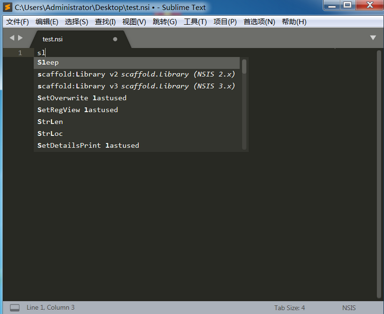
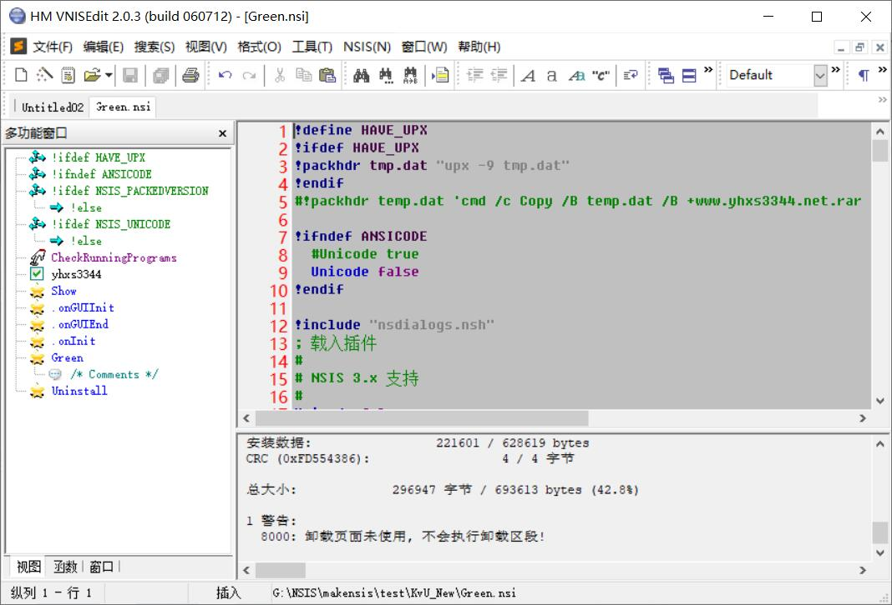

# NSIS ZH-CN

**语言：** [简体中文](README.md) · [English](README_en.md)

> **NSIS（Nullsoft Scriptable Install System）是一个开源的 Windows 系统下安装程序制作软件。它提供了安装、卸载、系统设置、文件解压缩等功能。正如其名字所指出的那样，NSIS 是通过它的脚本语言来描述安装程序的行为和逻辑的。NSIS 的脚本语言和通常的编程语言有类似的结构和语法，但它是为安装程序这类应用所设计的。**
> 基于 NSIS v3.12 官方版 和 jasonfriday13 nsisbi v3.12.3 中文翻译后重新编译的版本。

---

## 演示

**面板预览**

---

## 更新说明
- **更新时间：2026-09-06 **
- **更新 NSISBI v3.12.3版本，重新源码汉化。**
- **更新 NScurl.dll、nsis7z.dll、nsJSON.dll、ShellExecAsUser.dll 插件。**
- **新增 nsParser.dll 插件**

---

## 文件说明
- **code-zh-cn/nsisbi-v3.12.3  nsisbi翻译的中文版源码
- **code-zh-cn/nsis-v3.12  nsis翻译的中文版官方源码
- **docs 相关文档
- **images相关截图
- **Pugins-Code 收集的nsis插件源码
- **Ui-Examples nsis界面库例子
- **Ui-Pugins-Code  收集的nsis界面库插件源码
- **Plugins-Dll nsis Pugins dll(x86-ansi、x86-unicode、x64-ansi、x64-unicode) 

---

## Note

- **BY:yhxs344

- **WEB:www.yhxs344.net

- **QQ Group:436741130

---

## 许可与声明

本项目采用 **[GNU Affero General Public License v3.0](LICENSE)** 开源（`SPDX-License-Identifier: AGPL-3.0-or-later`）。

---

